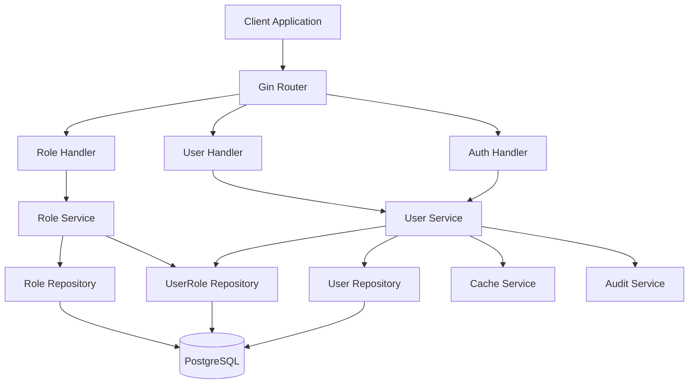
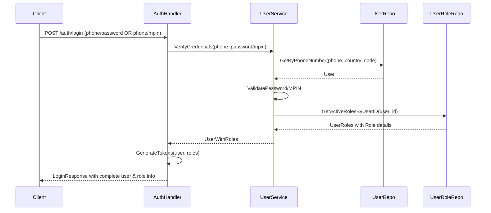
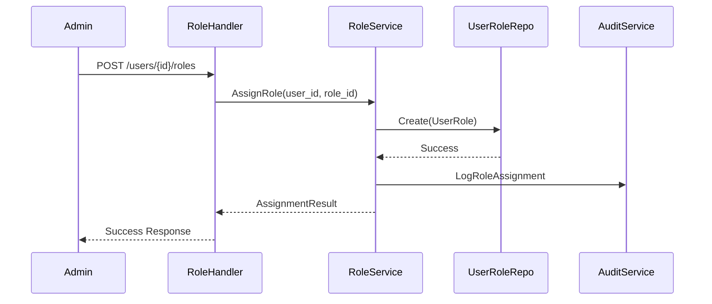

# Design Document

## Overview

This design addresses critical production gaps in the AAA v2 service by implementing comprehensive role management, MPIN authentication, enhanced login responses, and proper user lifecycle management. The solution follows existing architectural patterns while adding new capabilities to support production-ready authentication and authorization workflows.

The design leverages the existing GORM-based repository pattern, service layer architecture, and request/response structures while extending them to handle the identified gaps. All changes maintain backward compatibility and follow established security practices.

## Architecture

### High-Level Architecture



### Authentication Flow Enhancement



### Role Management Flow



## Components and Interfaces

### 1. Enhanced Authentication Components

#### LoginRequest Enhancement

```go
type LoginRequest struct {
    PhoneNumber string  `json:"phone_number" validate:"required"`
    CountryCode string  `json:"country_code" validate:"required"`
    Password    *string `json:"password,omitempty" validate:"omitempty,min=8"`
    MPin        *string `json:"mpin,omitempty" validate:"omitempty,len=4|len=6"`
    MFACode     *string `json:"mfa_code,omitempty"`
}
```

#### Enhanced LoginResponse

```go
type LoginResponse struct {
    AccessToken  string    `json:"access_token"`
    RefreshToken string    `json:"refresh_token"`
    TokenType    string    `json:"token_type"`
    ExpiresIn    int       `json:"expires_in"`
    User         *UserInfo `json:"user"`
    Message      string    `json:"message"`
}

type UserInfo struct {
    ID          string              `json:"id"`
    PhoneNumber string              `json:"phone_number"`
    CountryCode string              `json:"country_code"`
    Username    string              `json:"username"`
    IsValidated bool                `json:"is_validated"`
    CreatedAt   time.Time           `json:"created_at"`
    UpdatedAt   time.Time           `json:"updated_at"`
    Tokens      int                 `json:"tokens"`
    Roles       []UserRoleDetail    `json:"roles"`
    HasMPin     bool                `json:"has_mpin"`
    Profile     *UserProfileInfo    `json:"profile,omitempty"`
}

type UserRoleDetail struct {
    ID       string     `json:"id"`
    UserID   string     `json:"user_id"`
    RoleID   string     `json:"role_id"`
    Role     RoleDetail `json:"role"`
    IsActive bool       `json:"is_active"`
}

type RoleDetail struct {
    ID          string `json:"id"`
    Name        string `json:"name"`
    Description string `json:"description"`
    IsActive    bool   `json:"is_active"`
}
```

### 2. Role Management Components

#### Role Assignment Request/Response

```go
type AssignRoleRequest struct {
    RoleID string `json:"role_id" validate:"required"`
}

type AssignRoleResponse struct {
    Message string     `json:"message"`
    UserID  string     `json:"user_id"`
    Role    RoleDetail `json:"role"`
}

type RemoveRoleRequest struct {
    RoleID string `json:"role_id" validate:"required"`
}
```

### 3. MPIN Management Components

#### MPIN Request Structures

```go
type SetMPinRequest struct {
    MPin     string `json:"mpin" validate:"required,len=4|len=6"`
    Password string `json:"password" validate:"required"`
}

type UpdateMPinRequest struct {
    CurrentMPin string `json:"current_mpin" validate:"required,len=4|len=6"`
    NewMPin     string `json:"new_mpin" validate:"required,len=4|len=6"`
}
```

### 4. Enhanced User Service Interface

```go
type UserService interface {
    // Existing methods...

    // Enhanced authentication
    VerifyUserCredentials(ctx context.Context, phone, countryCode string, password, mpin *string) (*UserWithRoles, error)

    // MPIN management
    SetMPin(ctx context.Context, userID, mpin string) error
    UpdateMPin(ctx context.Context, userID, currentMPin, newMPin string) error
    VerifyMPin(ctx context.Context, userID, mpin string) error

    // Enhanced user retrieval
    GetUserWithRoles(ctx context.Context, userID string) (*UserWithRoles, error)
    GetUserWithProfile(ctx context.Context, userID string) (*UserWithProfile, error)

    // User lifecycle
    SoftDeleteUser(ctx context.Context, userID, deletedBy string) error
}

type RoleService interface {
    // Role assignment
    AssignRole(ctx context.Context, userID, roleID string) error
    RemoveRole(ctx context.Context, userID, roleID string) error

    // Role queries
    GetUserRoles(ctx context.Context, userID string) ([]UserRoleDetail, error)
    ValidateRoleAssignment(ctx context.Context, userID, roleID string) error
}
```

## Data Models

### Enhanced User Model

The existing User model already supports MPIN with the `MPin *string` field and `HasMPin()` method. No changes needed to the core model structure.

### UserRole Model Enhancement

The existing UserRole model is sufficient but we'll add helper methods:

```go
// Additional methods for UserRole model
func (ur *UserRole) IsActiveAssignment() bool {
    return ur.IsActive && ur.Role.IsActive
}

func (ur *UserRole) ToUserRoleDetail() UserRoleDetail {
    return UserRoleDetail{
        ID:       ur.ID,
        UserID:   ur.UserID,
        RoleID:   ur.RoleID,
        Role:     ur.Role.ToRoleDetail(),
        IsActive: ur.IsActive,
    }
}
```

### Repository Enhancements

#### UserRepository Extensions

```go
// Additional methods for UserRepository
func (r *UserRepository) GetWithActiveRoles(ctx context.Context, userID string) (*models.User, error)
func (r *UserRepository) SoftDeleteWithCascade(ctx context.Context, userID, deletedBy string) error
func (r *UserRepository) VerifyMPin(ctx context.Context, userID, hashedMPin string) error
```

#### UserRoleRepository Extensions

```go
type UserRoleRepository interface {
    // Existing methods...

    GetActiveRolesByUserID(ctx context.Context, userID string) ([]models.UserRole, error)
    AssignRole(ctx context.Context, userID, roleID string) error
    RemoveRole(ctx context.Context, userID, roleID string) error
    IsRoleAssigned(ctx context.Context, userID, roleID string) (bool, error)
}
```

## Error Handling

### Custom Error Types

```go
type RoleAssignmentError struct {
    UserID string
    RoleID string
    Reason string
}

func (e *RoleAssignmentError) Error() string {
    return fmt.Sprintf("role assignment failed for user %s and role %s: %s", e.UserID, e.RoleID, e.Reason)
}

type MPinError struct {
    UserID string
    Action string
    Reason string
}

func (e *MPinError) Error() string {
    return fmt.Sprintf("mpin %s failed for user %s: %s", e.Action, e.UserID, e.Reason)
}
```

### Error Response Standardization

```go
type ErrorResponse struct {
    Code      string `json:"code"`
    Message   string `json:"message"`
    Details   string `json:"details,omitempty"`
    RequestID string `json:"request_id"`
    Success   bool   `json:"success"`
    Timestamp string `json:"timestamp"`
}
```

## Testing Strategy

### Unit Testing Approach

1. **Service Layer Tests**

   - Mock repository dependencies
   - Test business logic in isolation
   - Validate error handling scenarios
   - Test concurrent operations

2. **Repository Layer Tests**

   - Use test database with transactions
   - Test CRUD operations
   - Validate constraint handling
   - Test concurrent access patterns

3. **Handler Layer Tests**
   - Mock service dependencies
   - Test request/response mapping
   - Validate input validation
   - Test authentication middleware integration

### Integration Testing

1. **Authentication Flow Tests**

   - End-to-end login with password
   - End-to-end login with MPIN
   - Token refresh scenarios
   - Role-based access control

2. **Role Management Tests**

   - Role assignment workflows
   - Role removal workflows
   - Concurrent role operations
   - Permission validation

3. **User Lifecycle Tests**
   - User creation with roles
   - User deletion with cleanup
   - MPIN management workflows
   - Profile management integration

### Test Data Management

```go
// Test fixtures for consistent testing
type TestFixtures struct {
    Users []models.User
    Roles []models.Role
    UserRoles []models.UserRole
}

func SetupTestData(db *gorm.DB) *TestFixtures {
    // Create test users, roles, and assignments
    // Return fixtures for test assertions
}

func CleanupTestData(db *gorm.DB, fixtures *TestFixtures) {
    // Clean up test data in reverse dependency order
}
```

## Security Considerations

### MPIN Security

1. **Hashing**: Use bcrypt with appropriate cost factor (12+)
2. **Validation**: Enforce 4-6 digit numeric format
3. **Rate Limiting**: Implement attempt limits for MPIN verification
4. **Audit Logging**: Log all MPIN operations for security monitoring

### Role Assignment Security

1. **Authorization**: Verify admin permissions before role operations
2. **Validation**: Ensure role and user exist before assignment
3. **Audit Trail**: Log all role changes with timestamps and actors
4. **Principle of Least Privilege**: Default to minimal permissions

### Authentication Security

1. **Token Security**: Maintain existing JWT security practices
2. **Session Management**: Implement proper token revocation
3. **Brute Force Protection**: Rate limit login attempts
4. **Input Validation**: Sanitize all inputs to prevent injection

## Performance Considerations

### Database Optimization

1. **Indexing Strategy**

   - Index on user_roles(user_id, is_active)
   - Index on users(phone_number, country_code)
   - Composite index on user_roles(user_id, role_id)

2. **Query Optimization**

   - Use preloading for role relationships
   - Implement query result caching
   - Batch operations for bulk role assignments

3. **Connection Management**
   - Leverage existing connection pooling
   - Use read replicas for query operations
   - Implement query timeouts

### Caching Strategy

```go
type CacheKeys struct {
    UserRoles    string // "user:roles:{user_id}"
    UserProfile  string // "user:profile:{user_id}"
    RoleDetails  string // "role:details:{role_id}"
}

// Cache TTL configurations
const (
    UserRolesCacheTTL    = 15 * time.Minute
    UserProfileCacheTTL  = 30 * time.Minute
    RoleDetailsCacheTTL  = 1 * time.Hour
)
```

## Migration Strategy

### Database Migrations

No schema changes required as existing models support all needed functionality:

- User.MPin field already exists
- UserRole relationships already established
- Role model supports all required fields

### Data Migration

1. **MPIN Migration**: No existing MPIN data to migrate
2. **Role Data**: Existing roles and assignments remain unchanged
3. **User Data**: All existing user data compatible

### Deployment Strategy

1. **Phase 1**: Deploy enhanced authentication (backward compatible)
2. **Phase 2**: Deploy role management APIs
3. **Phase 3**: Deploy MPIN management features
4. **Phase 4**: Deploy enhanced user deletion

Each phase maintains backward compatibility with existing clients while adding new capabilities.

## Monitoring and Observability

### Metrics to Track

1. **Authentication Metrics**

   - Login success/failure rates by method (password vs MPIN)
   - Token refresh success rates
   - Authentication latency

2. **Role Management Metrics**

   - Role assignment/removal rates
   - Role assignment errors
   - Permission check latency

3. **User Lifecycle Metrics**
   - User creation/deletion rates
   - MPIN adoption rates
   - Profile completion rates

### Logging Strategy

```go
type AuditLog struct {
    Action    string    `json:"action"`
    UserID    string    `json:"user_id"`
    ActorID   string    `json:"actor_id"`
    Resource  string    `json:"resource"`
    Details   string    `json:"details"`
    Timestamp time.Time `json:"timestamp"`
    IPAddress string    `json:"ip_address"`
}
```

### Health Checks

1. **Database Connectivity**: Verify repository operations
2. **Cache Connectivity**: Verify cache service operations
3. **Authentication Flow**: End-to-end login test
4. **Role Operations**: Basic role assignment test
