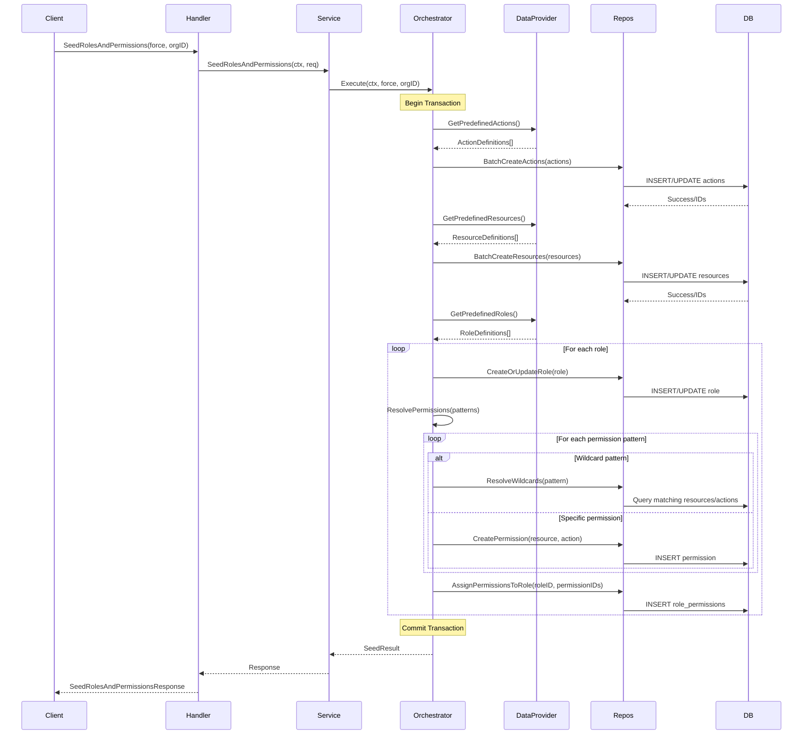

# CatalogService Architecture Design Document

## Executive Summary

This document outlines the complete architecture for implementing the CatalogService gRPC server with SeedRolesAndPermissions functionality in the AAA service. The design follows clean architecture principles, maintains idempotency, and ensures safe re-execution of seed operations.

## 1. Architecture Overview

### 1.1 High-Level Components

```
┌─────────────────────────────────────────────────────────────────┐
│                        gRPC Server Layer                         │
│                     (catalog_handler.go)                         │
└──────────────────────┬──────────────────────────────────────────┘
                       │
┌──────────────────────▼──────────────────────────────────────────┐
│                      Service Layer                               │
│  ┌─────────────────────────────────────────────────────────┐    │
│  │         CatalogService (catalog_service.go)             │    │
│  ├─────────────────────────────────────────────────────────┤    │
│  │      SeedOrchestrator (seed_orchestrator.go)            │    │
│  ├─────────────────────────────────────────────────────────┤    │
│  │     SeedDataProvider (seed_data_provider.go)            │    │
│  └─────────────────────────────────────────────────────────┘    │
└──────────────────────┬──────────────────────────────────────────┘
                       │
┌──────────────────────▼──────────────────────────────────────────┐
│                     Repository Layer                              │
│  ┌──────────┬──────────┬──────────┬────────────────────────┐    │
│  │  Action  │ Resource │   Role   │      Permission       │    │
│  │   Repo   │   Repo   │   Repo   │        Repo          │    │
│  └──────────┴──────────┴──────────┴────────────────────────┘    │
│  ┌────────────────────────────────────────────────────────┐     │
│  │         RolePermissionRepository                       │     │
│  └────────────────────────────────────────────────────────┘     │
└───────────────────────────────────────────────────────────────┘
```

### 1.2 Key Design Decisions

1. **Service Layer Separation**: Split functionality into focused services under 300 lines each
2. **Idempotent Operations**: Use upsert patterns with proper conflict resolution
3. **Transaction Management**: Atomic operations with proper rollback mechanisms
4. **Configuration as Code**: Embedded seed data with clear separation of concerns
5. **Repository Reuse**: Leverage existing repositories where possible

## 2. File Structure and Components

### 2.1 New Files to Create

```
internal/
├── grpc_server/
│   └── catalog_handler.go              # gRPC handler (250 lines)
├── services/
│   └── catalog/
│       ├── catalog_service.go          # Main service interface (150 lines)
│       ├── seed_orchestrator.go        # Orchestrates seeding (250 lines)
│       ├── seed_data_provider.go       # Provides seed data (200 lines)
│       ├── resource_manager.go         # Resource operations (200 lines)
│       ├── action_manager.go           # Action operations (200 lines)
│       ├── role_manager.go             # Role operations (250 lines)
│       └── permission_manager.go       # Permission operations (250 lines)
└── config/
    └── seed_data.go                    # Seed data definitions (150 lines)
```

### 2.2 Component Responsibilities

#### catalog_handler.go
- gRPC endpoint implementation
- Request/response mapping
- Error handling and status codes
- Service delegation

#### catalog_service.go
- Main service interface definition
- Dependency injection container
- Service coordination

#### seed_orchestrator.go
- Transaction management
- Operation sequencing
- Rollback handling
- Progress tracking

#### seed_data_provider.go
- Define predefined roles and permissions
- Permission matrix generation
- Data validation

#### resource_manager.go
- Resource CRUD operations
- Resource hierarchy management
- Idempotent resource creation

#### action_manager.go
- Action CRUD operations
- Static vs dynamic action handling
- Idempotent action creation

#### role_manager.go
- Role CRUD operations
- Scope management (GLOBAL/ORG)
- Role hierarchy handling

#### permission_manager.go
- Permission CRUD operations
- Role-permission assignment
- Batch operations

## 3. Interface Definitions

### 3.1 Service Interfaces

```go
// CatalogService defines the main catalog service interface
type CatalogService interface {
    // Core seeding operations
    SeedRolesAndPermissions(ctx context.Context, req *pb.SeedRolesAndPermissionsRequest) (*pb.SeedRolesAndPermissionsResponse, error)

    // Resource operations
    RegisterResource(ctx context.Context, req *pb.RegisterResourceRequest) (*pb.RegisterResourceResponse, error)
    ListResources(ctx context.Context, req *pb.ListResourcesRequest) (*pb.ListResourcesResponse, error)

    // Action operations
    RegisterAction(ctx context.Context, req *pb.RegisterActionRequest) (*pb.RegisterActionResponse, error)
    ListActions(ctx context.Context, req *pb.ListActionsRequest) (*pb.ListActionsResponse, error)

    // Role operations
    CreateRole(ctx context.Context, req *pb.CreateRoleRequest) (*pb.CreateRoleResponse, error)
    ListRoles(ctx context.Context, req *pb.ListRolesRequest) (*pb.ListRolesResponse, error)

    // Permission operations
    CreatePermission(ctx context.Context, req *pb.CreatePermissionRequest) (*pb.CreatePermissionResponse, error)
    AttachPermissions(ctx context.Context, req *pb.AttachPermissionsRequest) (*pb.AttachPermissionsResponse, error)
    ListPermissions(ctx context.Context, req *pb.ListPermissionsRequest) (*pb.ListPermissionsResponse, error)
}

// SeedOrchestrator manages the seeding process
type SeedOrchestrator interface {
    Execute(ctx context.Context, force bool, organizationID string) (*SeedResult, error)
    Validate(ctx context.Context) error
    Rollback(ctx context.Context, checkpoint *SeedCheckpoint) error
}

// SeedDataProvider supplies predefined data
type SeedDataProvider interface {
    GetPredefinedActions() []ActionDefinition
    GetPredefinedResources() []ResourceDefinition
    GetPredefinedRoles() []RoleDefinition
    GetRolePermissionMatrix() map[string][]string
}

// ResourceManager handles resource operations
type ResourceManager interface {
    CreateOrUpdate(ctx context.Context, resource *models.Resource) error
    EnsureExists(ctx context.Context, name string) (*models.Resource, error)
    BatchCreate(ctx context.Context, resources []*models.Resource) ([]string, error)
}

// ActionManager handles action operations
type ActionManager interface {
    CreateOrUpdate(ctx context.Context, action *models.Action) error
    EnsureExists(ctx context.Context, name string) (*models.Action, error)
    BatchCreate(ctx context.Context, actions []*models.Action) ([]string, error)
}

// RoleManager handles role operations
type RoleManager interface {
    CreateOrUpdate(ctx context.Context, role *models.Role) error
    EnsureExists(ctx context.Context, name string, scope models.RoleScope) (*models.Role, error)
    AssignPermissions(ctx context.Context, roleID string, permissionIDs []string) error
}

// PermissionManager handles permission operations
type PermissionManager interface {
    CreateOrUpdate(ctx context.Context, permission *models.Permission) error
    CreateFromPattern(ctx context.Context, pattern string, resourceID, actionID string) (*models.Permission, error)
    BatchCreate(ctx context.Context, permissions []*models.Permission) ([]string, error)
    ResolveWildcards(ctx context.Context, pattern string) ([]*models.Permission, error)
}
```

### 3.2 Data Structures

```go
// SeedResult contains the results of a seeding operation
type SeedResult struct {
    ActionsCreated      int32
    ResourcesCreated    int32
    RolesCreated        int32
    PermissionsCreated  int32
    CreatedRoleNames    []string
    Errors              []error
    Checkpoint          *SeedCheckpoint
}

// SeedCheckpoint allows for resumable operations
type SeedCheckpoint struct {
    Phase              string
    CompletedActions   []string
    CompletedResources []string
    CompletedRoles     []string
    Timestamp          time.Time
}

// ActionDefinition defines a predefined action
type ActionDefinition struct {
    Name        string
    Description string
    Category    string
    IsStatic    bool
}

// ResourceDefinition defines a predefined resource
type ResourceDefinition struct {
    Name        string
    Type        string
    Description string
}

// RoleDefinition defines a predefined role
type RoleDefinition struct {
    Name         string
    Description  string
    Scope        models.RoleScope
    Permissions  []string  // Permission patterns
}
```

## 4. Seeding Process Flow

### 4.1 SeedRolesAndPermissions Sequence



### 4.2 Idempotency Strategy

1. **Resource/Action Creation**: Use UPSERT with name as unique constraint
2. **Permission Creation**: Use composite key (resource_id, action_id)
3. **Role Creation**: Use name + scope as composite unique constraint
4. **Role-Permission Assignment**: Check existence before insert
5. **Force Flag Behavior**:
   - `force=false`: Skip existing, create missing (default)
   - `force=true`: Update existing, create missing

### 4.3 Transaction Boundaries

```go
// Pseudo-code for transaction management
func (o *SeedOrchestrator) Execute(ctx context.Context, force bool, orgID string) (*SeedResult, error) {
    tx := o.db.BeginTransaction()
    defer tx.Rollback() // Rollback if not committed

    checkpoint := &SeedCheckpoint{Phase: "actions"}

    // Phase 1: Actions
    actionIDs, err := o.seedActions(tx, force)
    if err != nil {
        return nil, err
    }
    checkpoint.CompletedActions = actionIDs
    checkpoint.Phase = "resources"

    // Phase 2: Resources
    resourceIDs, err := o.seedResources(tx, force)
    if err != nil {
        return nil, err
    }
    checkpoint.CompletedResources = resourceIDs
    checkpoint.Phase = "roles"

    // Phase 3: Roles and Permissions
    roleNames, permCount, err := o.seedRolesAndPermissions(tx, force, orgID)
    if err != nil {
        return nil, err
    }
    checkpoint.CompletedRoles = roleNames
    checkpoint.Phase = "complete"

    if err := tx.Commit(); err != nil {
        return nil, err
    }

    return &SeedResult{
        ActionsCreated:     int32(len(actionIDs)),
        ResourcesCreated:   int32(len(resourceIDs)),
        RolesCreated:       int32(len(roleNames)),
        PermissionsCreated: int32(permCount),
        CreatedRoleNames:   roleNames,
        Checkpoint:         checkpoint,
    }, nil
}
```

## 5. Seed Data Configuration

### 5.1 Predefined Data Structure

```go
// internal/config/seed_data.go

package config

import "github.com/Kisanlink/aaa-service/v2/internal/entities/models"

// SeedData contains all predefined data for the catalog service
var SeedData = struct {
    Actions   []ActionDefinition
    Resources []ResourceDefinition
    Roles     []RoleDefinition
}{
    Actions: []ActionDefinition{
        {Name: "create", Description: "Create new resources", Category: "general", IsStatic: true},
        {Name: "read", Description: "Read resource data", Category: "general", IsStatic: true},
        {Name: "update", Description: "Update existing resources", Category: "general", IsStatic: true},
        {Name: "delete", Description: "Delete resources", Category: "general", IsStatic: true},
        {Name: "list", Description: "List multiple resources", Category: "general", IsStatic: true},
        {Name: "manage", Description: "Full management access", Category: "general", IsStatic: true},
        {Name: "start", Description: "Start an operation or cycle", Category: "general", IsStatic: true},
        {Name: "end", Description: "End an operation or cycle", Category: "general", IsStatic: true},
        {Name: "assign", Description: "Assign resources or permissions", Category: "general", IsStatic: true},
    },

    Resources: []ResourceDefinition{
        {Name: "farmer", Type: "farmers-module/entity", Description: "Farmer entity resource"},
        {Name: "farm", Type: "farmers-module/entity", Description: "Farm entity resource"},
        {Name: "cycle", Type: "farmers-module/entity", Description: "Farming cycle resource"},
        {Name: "activity", Type: "farmers-module/entity", Description: "Farm activity resource"},
        {Name: "fpo", Type: "farmers-module/entity", Description: "Farmer Producer Organization resource"},
        {Name: "kisansathi", Type: "farmers-module/entity", Description: "Field agent resource"},
        {Name: "stage", Type: "farmers-module/entity", Description: "Crop stage resource"},
        {Name: "variety", Type: "farmers-module/entity", Description: "Crop variety resource"},
    },

    Roles: []RoleDefinition{
        {
            Name:        "farmer",
            Description: "Individual farmer with basic permissions",
            Scope:       models.RoleScopeGlobal,
            Permissions: []string{
                "farmer:*",  // All farmer operations
                "farm:*",    // All farm operations
                "cycle:*",   // All cycle operations
            },
        },
        {
            Name:        "kisansathi",
            Description: "Field agent supporting farmers",
            Scope:       models.RoleScopeGlobal,
            Permissions: []string{
                "farmer:*",      // All farmer operations
                "farm:*",        // All farm operations
                "cycle:*",       // All cycle operations
                "farmer:list",   // List farmers
                "farm:list",     // List farms
                "cycle:list",    // List cycles
                "activity:*",    // All activity operations
            },
        },
        {
            Name:        "CEO",
            Description: "FPO CEO with comprehensive permissions",
            Scope:       models.RoleScopeGlobal,
            Permissions: []string{
                "farmer:*",      // All farmer operations
                "farm:*",        // All farm operations
                "cycle:*",       // All cycle operations
                "farmer:list",   // List farmers
                "farm:list",     // List farms
                "cycle:list",    // List cycles
                "activity:*",    // All activity operations
                "fpo:*",         // All FPO operations
                "farmer:manage", // Manage farmers
                "kisansathi:*",  // All kisansathi operations
            },
        },
        {
            Name:        "fpo_manager",
            Description: "FPO manager with limited administrative permissions",
            Scope:       models.RoleScopeGlobal,
            Permissions: []string{
                "farmer:*",      // All farmer operations
                "farm:*",        // All farm operations
                "cycle:*",       // All cycle operations
                "activity:*",    // All activity operations
                "fpo:read",      // Read FPO data
                "farmer:list",   // List farmers
                "farm:list",     // List farms
                "cycle:list",    // List cycles
            },
        },
        {
            Name:        "admin",
            Description: "System administrator with full access",
            Scope:       models.RoleScopeGlobal,
            Permissions: []string{
                "*:*", // Wildcard - all resources and actions
            },
        },
        {
            Name:        "readonly",
            Description: "Read-only access to all resources",
            Scope:       models.RoleScopeGlobal,
            Permissions: []string{
                "*:read",  // Read all resources
                "*:list",  // List all resources
            },
        },
    },
}
```

## 6. Error Handling Strategy

### 6.1 Error Categories

1. **Validation Errors**: Invalid input, missing required fields
2. **Conflict Errors**: Duplicate resources, constraint violations
3. **Transaction Errors**: Database failures, deadlocks
4. **Permission Errors**: Insufficient privileges
5. **System Errors**: Connection issues, timeouts

### 6.2 Error Response Pattern

```go
type CatalogError struct {
    Code        string
    Message     string
    Details     map[string]interface{}
    Retryable   bool
    HttpStatus  int
}

func (e *CatalogError) Error() string {
    return fmt.Sprintf("[%s] %s", e.Code, e.Message)
}

// Error codes
const (
    ErrCodeValidation      = "CATALOG_VALIDATION_ERROR"
    ErrCodeConflict        = "CATALOG_CONFLICT"
    ErrCodeTransaction     = "CATALOG_TX_FAILED"
    ErrCodePermission      = "CATALOG_PERMISSION_DENIED"
    ErrCodeSystem          = "CATALOG_SYSTEM_ERROR"
    ErrCodePartialSuccess  = "CATALOG_PARTIAL_SUCCESS"
)
```

### 6.3 Graceful Degradation vs Fail-Fast

- **Fail-Fast Scenarios**:
  - Transaction initialization failure
  - Critical resource creation failure (actions, resources)
  - Database connection loss

- **Graceful Degradation Scenarios**:
  - Partial permission assignment failure (log and continue)
  - Non-critical metadata updates
  - Optional relationship creation

## 7. Testing Strategy

### 7.1 Unit Tests

```go
// Test files structure
internal/services/catalog/
├── catalog_service_test.go
├── seed_orchestrator_test.go
├── seed_data_provider_test.go
├── resource_manager_test.go
├── action_manager_test.go
├── role_manager_test.go
└── permission_manager_test.go
```

### 7.2 Integration Tests

```go
// Key test scenarios
func TestSeedRolesAndPermissions_Idempotency(t *testing.T)
func TestSeedRolesAndPermissions_ForceFlag(t *testing.T)
func TestSeedRolesAndPermissions_TransactionRollback(t *testing.T)
func TestSeedRolesAndPermissions_PartialFailure(t *testing.T)
func TestSeedRolesAndPermissions_WildcardExpansion(t *testing.T)
func TestSeedRolesAndPermissions_ConcurrentExecution(t *testing.T)
```

### 7.3 Test Data Fixtures

```go
// test/fixtures/catalog_fixtures.go
var TestRoles = []RoleDefinition{
    {
        Name:        "test_role",
        Scope:       models.RoleScopeGlobal,
        Permissions: []string{"test:read", "test:write"},
    },
}

var TestResources = []ResourceDefinition{
    {Name: "test_resource", Type: "test/entity"},
}

var TestActions = []ActionDefinition{
    {Name: "test_action", Category: "test", IsStatic: true},
}
```

## 8. Integration Points

### 8.1 gRPC Server Registration

```go
// internal/grpc_server/grpc_server.go
func (s *GRPCServer) registerServices() {
    // ... existing services ...

    // Register CatalogService
    catalogService := catalog.NewCatalogService(
        s.dbManager,
        s.logger,
    )
    catalogHandler := NewCatalogHandler(catalogService, s.logger)
    pb.RegisterCatalogServiceServer(s.server, catalogHandler)

    s.logger.Info("CatalogService registered successfully")
}
```

### 8.2 Repository Dependencies

- **Existing Repositories to Use**:
  - `RoleRepository` (internal/repositories/roles)
  - `PermissionRepository` (internal/repositories/permissions)
  - `RolePermissionRepository` (internal/repositories/role_permissions)

- **New Repositories Needed**:
  - `ActionRepository` (already exists, will reuse)
  - `ResourceRepository` (internal/repositories/resources)

## 9. Architecture Decision Records (ADRs)

### ADR-001: Use Embedded Seed Data

**Status**: Accepted

**Context**: Need to define predefined roles and permissions for the farmers-module.

**Decision**: Embed seed data as Go constants/variables rather than external configuration files.

**Consequences**:
- ✅ Compile-time validation
- ✅ No external dependencies
- ✅ Version controlled with code
- ❌ Requires recompilation for changes

### ADR-002: Transaction-Per-Seed Operation

**Status**: Accepted

**Context**: Need atomic operations for seeding to prevent partial states.

**Decision**: Wrap entire seed operation in a single database transaction.

**Consequences**:
- ✅ Atomic operations
- ✅ Consistent state
- ✅ Simple rollback
- ❌ Longer transaction duration
- ❌ Potential for lock contention

### ADR-003: Wildcard Permission Expansion

**Status**: Accepted

**Context**: Roles define permissions using wildcards (e.g., "farmer:*").

**Decision**: Expand wildcards at seed time into concrete permissions.

**Consequences**:
- ✅ Explicit permission checking
- ✅ Better performance at runtime
- ✅ Clear audit trail
- ❌ More storage required
- ❌ Need to re-seed when new actions added

### ADR-004: Idempotent Upsert Pattern

**Status**: Accepted

**Context**: Seed operation must be safely re-runnable.

**Decision**: Use UPSERT (INSERT ON CONFLICT UPDATE) for all seed operations.

**Consequences**:
- ✅ Safe re-execution
- ✅ No duplicate errors
- ✅ Supports updates
- ❌ Slightly more complex queries
- ❌ Need to track what constitutes a conflict

## 10. Monitoring and Observability

### 10.1 Metrics

```go
// Prometheus metrics
catalog_seed_duration_seconds{phase="actions|resources|roles|permissions"}
catalog_seed_items_created{type="action|resource|role|permission"}
catalog_seed_errors_total{type="validation|conflict|transaction"}
catalog_seed_operations_total{status="success|failure|partial"}
```

### 10.2 Logging

```go
// Structured logging for each phase
logger.Info("Starting catalog seed operation",
    zap.Bool("force", force),
    zap.String("organization_id", orgID),
    zap.String("phase", "initialization"),
)

logger.Info("Seed phase completed",
    zap.String("phase", phase),
    zap.Int("items_created", count),
    zap.Duration("duration", duration),
)
```

### 10.3 Tracing

```go
// OpenTelemetry spans
span := tracer.Start(ctx, "catalog.seed_roles_and_permissions")
defer span.End()

actionSpan := tracer.Start(ctx, "catalog.seed_actions")
// ... seed actions ...
actionSpan.End()
```

## 11. Security Considerations

### 11.1 Authorization

- Only system administrators can trigger seed operations
- Organization-specific seeding requires org admin privileges
- Audit all seed operations

### 11.2 Input Validation

- Validate organization ID if provided
- Sanitize all input patterns
- Prevent SQL injection in wildcard expansion

### 11.3 Rate Limiting

- Limit seed operations to prevent DoS
- Implement backoff for retries
- Monitor for abuse patterns

## 12. Performance Optimizations

### 12.1 Batch Operations

- Batch insert actions/resources (chunks of 100)
- Bulk permission creation
- Prepared statements for repeated queries

### 12.2 Caching Strategy

- Cache expanded wildcard permissions
- Cache role-permission mappings
- Invalidate on seed operations

### 12.3 Query Optimization

- Use indexes on name fields
- Composite indexes for unique constraints
- Avoid N+1 queries in permission resolution

## 13. Migration and Rollback Strategy

### 13.1 Forward Migration

```sql
-- Ensure unique constraints exist
ALTER TABLE actions ADD CONSTRAINT uk_actions_name UNIQUE (name);
ALTER TABLE resources ADD CONSTRAINT uk_resources_name UNIQUE (name);
ALTER TABLE roles ADD CONSTRAINT uk_roles_name_scope UNIQUE (name, scope);
ALTER TABLE permissions ADD CONSTRAINT uk_permissions_resource_action UNIQUE (resource_id, action_id);
```

### 13.2 Rollback Procedure

```go
func (o *SeedOrchestrator) Rollback(ctx context.Context, checkpoint *SeedCheckpoint) error {
    tx := o.db.BeginTransaction()
    defer tx.Rollback()

    // Rollback in reverse order
    if checkpoint.Phase == "complete" || checkpoint.Phase == "roles" {
        // Remove role-permission assignments
        for _, roleName := range checkpoint.CompletedRoles {
            tx.Exec("DELETE FROM role_permissions WHERE role_id IN (SELECT id FROM roles WHERE name = ?)", roleName)
        }
    }

    // Note: We don't delete actions/resources as they might be used elsewhere

    return tx.Commit()
}
```

## 14. Future Enhancements

1. **Dynamic Seed Data Loading**: Support loading seed data from external sources
2. **Incremental Seeding**: Only seed new/changed items
3. **Seed Versioning**: Track seed data versions for migrations
4. **Multi-Tenant Seeding**: Organization-specific seed templates
5. **Seed Data Validation**: Pre-flight validation before execution
6. **Dry-Run Mode**: Preview changes without applying
7. **Seed Data Export**: Export current state as seed template

## Appendix A: Sample Implementation Snippets

### A.1 Catalog Handler Implementation

```go
// internal/grpc_server/catalog_handler.go
package grpc_server

import (
    "context"

    "github.com/Kisanlink/aaa-service/v2/internal/services/catalog"
    pb "github.com/Kisanlink/aaa-service/v2/pkg/proto"
    "go.uber.org/zap"
    "google.golang.org/grpc/codes"
    "google.golang.org/grpc/status"
)

type CatalogHandler struct {
    pb.UnimplementedCatalogServiceServer
    service catalog.CatalogService
    logger  *zap.Logger
}

func NewCatalogHandler(service catalog.CatalogService, logger *zap.Logger) *CatalogHandler {
    return &CatalogHandler{
        service: service,
        logger:  logger,
    }
}

func (h *CatalogHandler) SeedRolesAndPermissions(
    ctx context.Context,
    req *pb.SeedRolesAndPermissionsRequest,
) (*pb.SeedRolesAndPermissionsResponse, error) {
    h.logger.Info("Seeding roles and permissions",
        zap.Bool("force", req.Force),
        zap.String("organization_id", req.OrganizationId),
    )

    result, err := h.service.SeedRolesAndPermissions(ctx, req)
    if err != nil {
        h.logger.Error("Failed to seed roles and permissions", zap.Error(err))
        return nil, status.Errorf(codes.Internal, "seeding failed: %v", err)
    }

    return result, nil
}
```

### A.2 Permission Pattern Resolution

```go
// internal/services/catalog/permission_manager.go
func (pm *PermissionManager) ResolveWildcards(ctx context.Context, pattern string) ([]*models.Permission, error) {
    parts := strings.Split(pattern, ":")
    if len(parts) != 2 {
        return nil, fmt.Errorf("invalid permission pattern: %s", pattern)
    }

    resourcePattern := parts[0]
    actionPattern := parts[1]

    var permissions []*models.Permission

    // Resolve resource wildcards
    resources, err := pm.resolveResourcePattern(ctx, resourcePattern)
    if err != nil {
        return nil, err
    }

    // Resolve action wildcards
    actions, err := pm.resolveActionPattern(ctx, actionPattern)
    if err != nil {
        return nil, err
    }

    // Create permission combinations
    for _, resource := range resources {
        for _, action := range actions {
            permission := models.NewPermissionWithResourceAndAction(
                fmt.Sprintf("%s:%s", resource.Name, action.Name),
                fmt.Sprintf("Permission for %s on %s", action.Name, resource.Name),
                resource.ID,
                action.ID,
            )
            permissions = append(permissions, permission)
        }
    }

    return permissions, nil
}
```

## Conclusion

This architecture provides a robust, scalable, and maintainable solution for implementing the CatalogService with comprehensive seeding capabilities. The design ensures idempotency, proper transaction management, and clear separation of concerns while adhering to the codebase's architectural principles and file size constraints.
