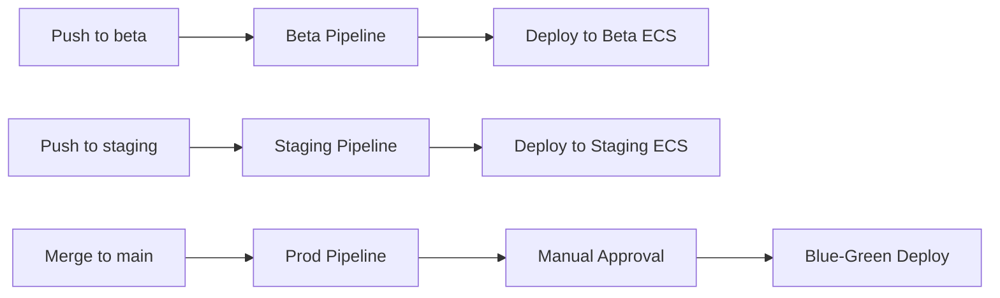

# AAA Service Infrastructure

Infrastructure as Code for deploying the AAA service across multiple environments.

## Quick Start

### Deploy All Environments

```bash
cd infrastructure

# Validate templates first
make validate

# Deploy environments
make deploy-beta      # ~15-20 minutes
make deploy-staging   # ~15-20 minutes
make deploy-prod      # ~15-20 minutes
```

### Check Status

```bash
make status-beta
make status-staging
make status-prod
```

## Directory Structure

```
infrastructure/
├── README.md                          # This file
├── DEPLOYMENT_GUIDE.md                # Complete deployment guide
├── Makefile                           # Deployment automation
├── cloudformation-pipeline.yaml       # CI/CD pipeline infrastructure
└── parameters/
    ├── beta.json                      # Beta environment parameters
    ├── staging.json                   # Staging environment parameters
    └── prod.json                      # Production environment parameters
```

## Environments

| Environment | Branch   | Deployment      | Approval | Multi-AZ | Cost/Month |
|-------------|----------|-----------------|----------|----------|------------|
| **Beta**    | `beta`   | Rolling Update  | None     | No       | ~$50       |
| **Staging** | `staging`| Rolling Update  | None     | No       | ~$50       |
| **Prod**    | `main`   | Blue-Green      | Manual   | Yes      | ~$150-200  |

## CI/CD Workflow



## Key Files

### Parent Directory Files (Used by Infrastructure)
- `../cloudformation.yaml` - Main infrastructure template (VPC, ECS, RDS, Redis, ALB)
- `../cloudformation-codedeploy.yaml` - Blue-green deployment setup (production only)
- `../buildspec.yml` - CodeBuild build instructions
- `../appspec.yml` - CodeDeploy deployment spec

### Configuration Files
- `parameters/beta.json` - Beta: 1 task, t3.micro instances, single-AZ
- `parameters/staging.json` - Staging: 2 tasks, t3.micro instances, single-AZ
- `parameters/prod.json` - Production: 2-10 tasks, t3.small instances, multi-AZ

## Common Commands

### Deploy
```bash
# Deploy specific environment
make deploy-beta
make deploy-staging
make deploy-prod

# Or use AWS CLI directly
aws cloudformation deploy \
  --stack-name aaa-service-beta \
  --template-file ../cloudformation.yaml \
  --parameter-overrides file://parameters/beta.json \
  --capabilities CAPABILITY_NAMED_IAM \
  --region ap-south-1
```

### Check Status
```bash
# Quick status check
make status-beta

# Detailed status
aws cloudformation describe-stacks \
  --stack-name aaa-service-beta \
  --region ap-south-1
```

### Update Stack
```bash
# Just run deploy again - CloudFormation handles updates
make deploy-beta
```

### Delete Stack
```bash
# With confirmation prompts
make delete-beta

# Direct deletion (careful!)
aws cloudformation delete-stack \
  --stack-name aaa-service-beta \
  --region ap-south-1
```

### View Resources
```bash
# Get ALB URL
aws cloudformation describe-stacks \
  --stack-name aaa-service-beta \
  --query 'Stacks[0].Outputs[?OutputKey==`HTTPEndpoint`].OutputValue' \
  --output text

# Get all outputs
aws cloudformation describe-stacks \
  --stack-name aaa-service-beta \
  --query 'Stacks[0].Outputs' \
  --output table
```

## Setup Steps

Follow these steps in order:

1. **Deploy Infrastructure** (This section)
   ```bash
   make deploy-beta
   make deploy-staging
   make deploy-prod
   ```

2. **Set Up CodeDeploy** (Production only)
   ```bash
   # See DEPLOYMENT_GUIDE.md Step 3
   ```

3. **Deploy CI/CD Pipeline**
   ```bash
   # See DEPLOYMENT_GUIDE.md Step 4
   ```

4. **Configure Git Branches**
   ```bash
   git checkout -b beta && git push -u origin beta
   git checkout -b staging && git push -u origin staging
   ```

5. **Test Deployments**
   ```bash
   # Push to beta branch - should trigger pipeline
   git checkout beta
   echo "test" >> README.md
   git commit -am "test: trigger beta pipeline"
   git push origin beta
   ```

## Monitoring

### CloudWatch Logs
```bash
# View service logs
aws logs tail /ecs/aaa-service-beta --follow

# View build logs
aws logs tail /aws/codebuild/aaa-service-build --follow
```

### ECS Service Status
```bash
aws ecs describe-services \
  --cluster aaa-service-beta-cluster \
  --services aaa-service-beta
```

### Pipeline Status
```bash
aws codepipeline get-pipeline-state \
  --name aaa-service-beta-pipeline
```

## Troubleshooting

### Stack Creation Fails
```bash
# View events to see what failed
aws cloudformation describe-stack-events \
  --stack-name aaa-service-beta \
  --max-items 50

# Common issues:
# - Redis AuthToken format error (fixed in latest template)
# - Insufficient permissions
# - Resource limits (check service quotas)
```

### Update Stack with Failed State
```bash
# If stack is in CREATE_FAILED or UPDATE_FAILED
aws cloudformation delete-stack --stack-name aaa-service-beta
aws cloudformation wait stack-delete-complete --stack-name aaa-service-beta
make deploy-beta
```

### Service Won't Start
```bash
# Check task logs
aws logs tail /ecs/aaa-service-beta --follow

# Check task failures
aws ecs describe-tasks \
  --cluster aaa-service-beta-cluster \
  --tasks $(aws ecs list-tasks \
    --cluster aaa-service-beta-cluster \
    --service-name aaa-service-beta \
    --query 'taskArns[0]' --output text)
```

## Cost Breakdown

### Per Environment (Non-Prod)
- NAT Gateway: $32/month
- RDS t3.micro: $15/month
- Redis t3.micro: $12/month
- ECS Fargate (1-2 tasks): $15/month
- ALB: $18/month
- **Total: ~$50-80/month**

### Production
- NAT Gateway: $32/month
- RDS t3.small Multi-AZ: $60/month
- Redis t3.small Multi-AZ: $35/month
- ECS Fargate (2-10 tasks): $30-150/month
- ALB: $18/month
- **Total: ~$150-250/month**

### CI/CD Pipeline
- CodePipeline: $1/pipeline ($3 total)
- CodeBuild: $0.005/minute (~$10/month)
- S3 Artifacts: ~$5/month
- **Total: ~$18/month**

**Grand Total: ~$250-400/month** for all environments

## Parameter Customization

Edit `parameters/{env}.json` to customize:

- **Instance sizes**: `DBInstanceClass`, `CacheNodeType`, `TaskCPU`, `TaskMemory`
- **Scaling**: `MinTaskCount`, `MaxTaskCount`, `DesiredTaskCount`
- **Features**: `EnableAutoMigrate`, `EnableSeed`, `EnableDocs`
- **High availability**: `EnableMultiAZ` (recommend `true` for prod only)
- **Backups**: `DBBackupRetentionPeriod`

After editing, redeploy:
```bash
make deploy-beta  # or staging/prod
```

## Security Notes

- ✅ All secrets stored in AWS Secrets Manager
- ✅ Private subnets for database and application
- ✅ Security groups with least-privilege access
- ✅ Encrypted RDS and Redis at rest
- ✅ TLS in transit for Redis
- ✅ IAM roles with minimal permissions
- ✅ VPC isolation between environments

## Additional Resources

- [Complete Deployment Guide](./DEPLOYMENT_GUIDE.md) - Step-by-step setup
- [Main CloudFormation Template](../cloudformation.yaml) - Infrastructure code
- [Pipeline Template](./cloudformation-pipeline.yaml) - CI/CD infrastructure
- [AWS ECS Best Practices](https://docs.aws.amazon.com/AmazonECS/latest/bestpracticesguide/)
- [CodeDeploy Blue-Green Guide](https://docs.aws.amazon.com/codedeploy/latest/userguide/deployments-create-ecs-cfn.html)

## Support

For issues:
1. Check [DEPLOYMENT_GUIDE.md](./DEPLOYMENT_GUIDE.md) troubleshooting section
2. Review CloudFormation events
3. Check CloudWatch logs
4. Verify prerequisites are met
